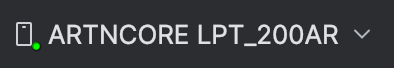
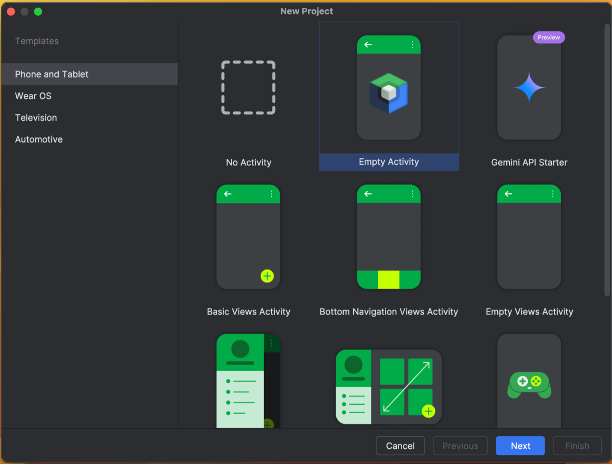
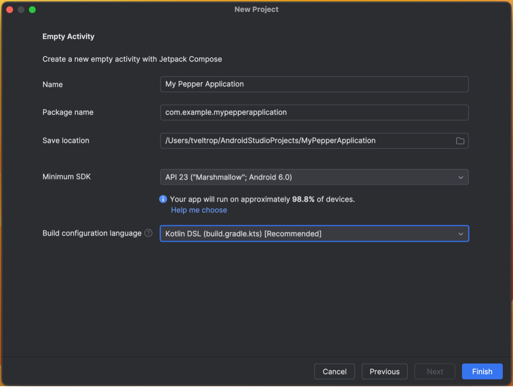

Pepper with Android Studio in 2024
==================================
Programming applications for Pepper QiSDK (the latest version of Pepper) is done by creating Android applications in Android Studio. The "QiSDK Plugin" for Android Studio was published for this in 2017, but as of November 2024 it is no longer compatible with Android Studio.

This guide will assist you in using Android Studio with Pepper — without the need of the plugin.

This guide was written with **Android Studio Ladybug 2024.2.1.11**.

* [What did the plugin do?](#what-did-the-plugin-do-)
* [Connecting to Pepper](#connecting-to-pepper)
    * [Connect to Pepper with ADB](#connect-to-pepper-with-adb)
    * [Adding ADB to PATH](#adding-adb-to-path)
        * [Mac](#mac)
        * [Linux](#linux)
        * [Windows](#windows)
* [Using an old robot project](#using-an-old-robot-project)
* [Starting a new robot project from template](#starting-a-new-robot-project-from-template)
* [Starting a new robot project from scratch](#starting-a-new-robot-project-from-scratch)
    * [Initial bare project skeleton](#initial-bare-project-skeleton)
    * [Configure project for QiSDK](#configure-project-for-qisdk)
    * [Troubleshooting](#troubleshooting)
* [Adding robotic animations to project](#adding-robotic-animations-to-project)

# What did the plugin do?
The plugin is not necessary for building Pepper Android apps.
It provided the following features for convenience:

- **Interface to connect to Pepper**  
  When the plugin was first developed, the default ADB in Android Studio was not able to connect to Pepper (over TCP/IP), so a compatible version of ADB was bundled into the plugin, and a button was added to the toolbar to access it.
  This is no longer necessary, as newer versions of Android Studio are compatible.  
  This guide will show how to connect manually with ADB.

- **“Robotification” of existing Android Studio projects**  
  The plugin automatically adds required details to the gradle build files to use QiSDK.  
  This guide will show how to do this manually.

- **Animation browser and library**  
  Many robotic animations were bundled into the plugin (waving hello, etc), with a GUI element to browse them and automatically add them to the project.  
  This guide will show where to access robotic animations, and add them to your project.

- **QiChat syntax highlighting**  
  The plugin provides syntax highlighting and code completion for QiChat top files.  
  No alternative solution for this functionality is provided by this guide.

- **Pepper Emulator**  
  The plugin provides an Android Virtual Device with an emulated Pepper robot.  
  No alternative solution for this functionality is available.

# Connecting to Pepper
To connect to Pepper with Android Studio, we must now manage ADB manually.
- Make sure Developer Mode and ADB are enabled on Pepper’s tablet.
  For details, [please consult standard Android documentation](https://developer.android.com/studio/debug/dev-options).
- Make sure your computer and Pepper’s tablet are on the same [WIFI] network.

## Connect to Pepper with ADB
Look at the notifications on Pepper’s tablet, and note the IP address under the section For Run/Debug Config, and substitute it in the following command.
**If it the notification doesn't appear, make sure Pepper’s tablet is in Developer Mode, and is connected to WIFI.**

Issue the following command in Android Studio’s terminal:  
`adb connect 192.168.1.2`

**If adb is not found, see the instructions below: [Adding ADB to PATH](#adding-adb-to-path).**

On Pepper’s tablet, the *Allow ADB?* popup will appear, approve it. **If you don't see the popup, it might be hiding behind the notifications.**

In Android Studio’s toolbar, you will see *ARTNCORE LPT\_200AR* in the *Running devices* list.



You can now install & run applications on Pepper by pressing the *Run* button in Android Studio.

## Adding ADB to PATH

### Mac
Open a terminal, and use the following command to determine your shell:  
`echo $SHELL`

If you see “/bin/bash”, use this command next:  
`echo 'export PATH="$PATH:~/Library/Android/sdk/platform-tools"' >> ~/.bash\_profile`

Otherwise if you see “/bin/zsh”, use this command next:  
`echo 'export PATH="$PATH:~/Library/Android/sdk/platform-tools"' >> ~/.zprofile`

Close the terminal, because a fresh terminal is needed to load the new path.

### Linux
Open a terminal, and use the following command to determine your shell:  
`echo $SHELL`

If you see “/bin/bash”, use this command next:  
`echo 'export PATH="$PATH:~/Android/Sdk/platform-tools"' >> ~/.bash\_profile`

Otherwise if you see “/bin/zsh”, use this command next:  
`echo 'export PATH="$PATH:~/Android/Sdk/platform-tools"' >> ~/.zprofile`

Close the terminal, because a fresh terminal is needed to load the new path.

### Windows
Right-click on *This PC* or *My Computer* on your desktop or in File Explorer and select *Properties*.

In the System window, find and click *Advanced system settings*. 

In the System Properties window, click the *Environment Variables* button near the bottom.

Select the *Path* variable in the *System variables* section and click *Edit*.
In the Edit Environment Variable dialog, you’ll see a list of paths, click *New* and add the following:  
`%USERPROFILE%\AppData\Local\Android\sdk\platform-tools`

Press *OK* to save the changes, and then **reboot**.


# Using an old robot project
Your old Android Studio Pepper projects are still usable with the new Android Studio.  No additional steps need to be taken for Pepper/QiSDK.

After upgrading Android Studio, you may however find that your project’s particular gradle configuration or dependencies need to be updated.  The details of which is a case-by-case basis and beyond the scope of this document.

# Starting a new robot project from template
We have provided a project template that is compatible with Android Studio Ladybug (2024.2.1 Patch 2) based upon this guide.

It is available for download here: <https://github.com/unitedroboticsgroup-france/MyPepperApplication>

**We strongly recommend to change the key details of this project (EG: name, applicationId, namespace, etc).** Please refer to standard Android Documentation for this.

# Starting a new robot project from scratch
## Initial bare project skeleton
Create a *New Project* from the Android Studio *File* menu. 



Select *Empty Activity* then *Next*.



Select *Minimum SDK: API 23* and *Build configuration language: Kotlin DSL,* then *Finish*.

**Android Studio might not set up projects correctly out-of-the-box.  So before configuring the project for Pepper, build it once to diagnose any Android-specific configuration issues. The [troubleshooting](#troubleshooting) section below highlights an issue we encountered when setting up our template project.**

After verifying that the bare project builds (*Build Menu / Make Project*), press the *Run* button while ADB is connected to Pepper, to isolate and troubleshoot any remaining issues before configuring the project for the QiSDK.  The empty activity hello world style application should display on Pepper.

## Configure project for QiSDK
Edit the project’s *settings.gradle.kts* to include the *https://qisdk.softbankrobotics.com/sdk-beta/maven* repository in *dependencyResolutionManagement* like below.

```gradle
dependencyResolutionManagement {
    repositoriesMode.set(RepositoriesMode.FAIL_ON_PROJECT_REPOS)
    repositories {
        google()
        mavenCentral()
        maven {
            url = uri("https://qisdk.softbankrobotics.com/sdk-beta/maven")
        }
    }
}
```

Edit the app module’s *build.gradle.kts* to include the *com.aldebaran:qisdk* dependency:

(Note that the *build.gradle.kts* generated by Android Studio will of course contain other dependencies, we are only showing the QiSDK specifics below.)

```gradle
dependencies {
    //noinspection UseTomlInstead
    implementation("com.aldebaran:qisdk:1.7.5")
}
```

Set up *MainActivity.kt* to inherit from *RobotLifecycleCallbacks* like below; modifying the *onCreate* and implementing *onDestroy, onRobotFocusGained, onRobotFocusLost, and onRobotFocusRefused* overrides.  (Note that the *MainActivity.kt* generated by Android Studio will of course contain other code, we are only showing the QiSDK specifics below)

```kotlin
class MainActivity : ComponentActivity(), RobotLifecycleCallbacks {
    override fun onCreate(savedInstanceState: Bundle?) {
        super.onCreate(savedInstanceState)
        QiSDK.register(this, this)
        }
    }

    override fun onDestroy() {
        QiSDK.unregister(this, this)
        super.onDestroy()
    }
    
    override fun onRobotFocusGained(qiContext: QiContext?) {
    }
    
    override fun onRobotFocusLost() {
    }

    override fun onRobotFocusRefused(reason: String?) {
    }
```

Add some basic code to *onRobotFocusGained* to fully verify functionality of the QiSDK, and run the application!

```kotlin
    override fun onRobotFocusGained(qiContext: QiContext?) {
        val say: Say = SayBuilder.with(qiContext)
            .withText("Hello human!")
            .build()
        say.run()
    }
```

In case Android Studio fails to load the imports for you automatically, here they are:

```kotlin
import com.aldebaran.qi.sdk.QiContext
import com.aldebaran.qi.sdk.QiSDK
import com.aldebaran.qi.sdk.RobotLifecycleCallbacks
import com.aldebaran.qi.sdk.builder.SayBuilder
import com.aldebaran.qi.sdk.`object`.conversation.Say
```


## Troubleshooting
If you have build errors such as:
`Dependency ‘...’ requires libraries and applications that depend on it co compile against version 35 or later of the Android APIs`,
then update the *compileSdk* and *targetSdk* in *app/buildgradle.kts* to **35**.

Or use the *Project Structure* dialog to set *Compile SDK Version* and *Target SDK Version* to **35**.

# Adding robotic animations to project
Many animations are hosted at the following GitHub repository: <https://github.com/softbankrobotics-labs/pepper-core-anims>

After downloading this repository, you can add any of the *.qianim* to your project, to the *res/raw* directory.  Then you can run the animations as usual:

```kotlin
val animation: Animation = AnimationBuilder.with(qiContext) 
    .withResources(R.raw.Hello\_01)
    .build()
var animate: Animate = AnimateBuilder.with(qiContext)
    .withAnimation(animation)
    .build() 
val animateFuture: Future<Void> = animate.async().run()
```
